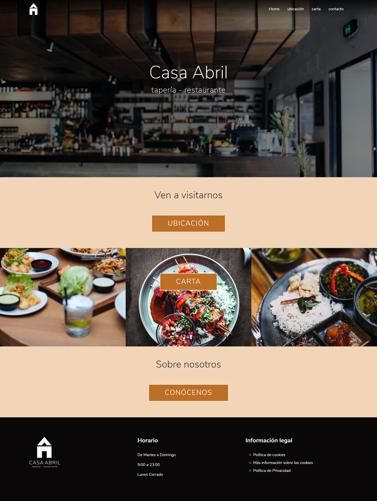

<h1>Diseño web Restaurante Casa Abril </h1>
## Tabla de contenidos
*  [Descripción](#Descripción)
*  [Muestra](#Muestra)
*  [Herramientas](#Herramientas)
*  [Contacto](#Contacto)

## Descripción
Propuesta de diseño web para el ficticio Restaurante Casa Abril.
Incluye un planteamiento de identidad corporativa que ya se aplica en la maquetación de las diferentes secciones de la web.

## Muestra

[👉 Ir a la web](https://capceres.github.io/reto1/home.html)

## Herramientas
* HTML5
* CSS3
* Bootstrap 5

*Se incluyen imágenes  de stock gratuitas de [Pexels](https://www.pexels.com/)

## Contacto

[Email de contacto](mailto:cap-12@hotmail.com?subject=Hola% "Hola!")

[Volver al principio](#Tabla-de-contenidos)

